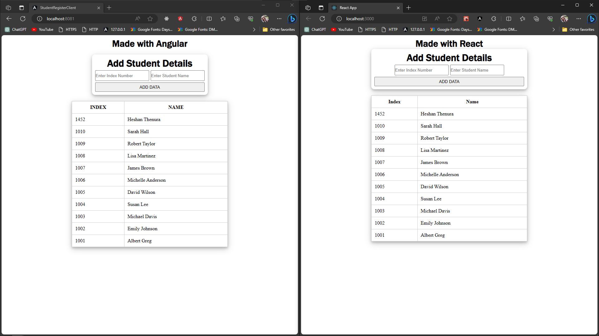

<h1 align="center">Comparing Angular and React for Web App Development</h1>

## Menu

### <a href="#overview">1.Overview</a>

### <a href="#project-generation">2.Project Generation</a>

### [3.Project Structure](#project-structure)

### [4.Technical Comparisons](#technical-comparisons)

- ### [Iterating and Rendering](#iterating-and-rendering)
- ### [Sending HTTP Requests](#sending-HTTP-requests)
- ### [Code Organization and Cleanliness](#code-organization-and-cleanliness)

## 1. <span id="overview">Overview</span>



In this article, I'll share my experience of building the same web app using two different frameworks, Angular and React. I'll provide a detailed comparison of my development journey with each framework, highlighting the pros and cons of both, to help you make an informed choice for your future web development projects

Furthermore, it's worth noting that the learning curve for React and Angular can also vary significantly from person to person. However, I found both frameworks relatively approachable and did not encounter significant obstacles during the learning process. While the learning experience can be unique to each individual, I chose not to delve into this aspect in detail as both React and Angular offer ample resources and community support to facilitate the learning journey.

## 2.<span id="project-generation">Project Generation</span>

I generated the Angular web app using Angular CLI version 16.2.5 and for the React project, I opted for Yarn due to issues encountered during the initial project creation with npm. Both projects are built using TypeScript, offering a robust and statically typed foundation for web development

- #### comman that I used to generate Angular project

```bash
ng new <Project Name>
```

### this took about no more than 2 mins to generate Angular project

- #### comman that I used to generate React project

```bash
yarn create react-app my-app --template typescript
```

### this took about 10 mins to generate React project. Maybe because of my internet

<h3 align="center"> 🟢 When comparing project generation winner is Angular 🟢</h3>

## 3.<span id="project-structure">Project File Structure</span>

In the Angular project, component generation is a breeze with Angular CLI. It automatically generates an organized file structure for each component, including HTML, CSS, TypeScript, and a separate spec.ts file within a dedicated folder named after the component. This structured approach makes it easy to maintain and manage components

On the React side of things, I adopted a slightly different approach. While component creation in React doesn't have the same level of automation as Angular, I utilized the ['ES7+ React/Redux/React-Native snippets']("https://marketplace.visualstudio.com/items?itemName=dsznajder.es7-react-js-snippets") extension available in Visual Studio Code. With this extension, I could streamline component generation using the `rafce` command, which efficiently generates the component's code and exports it with the component name. Although not as automated as Angular, this approach still ensures a well-organized project structure.

- #### This is the code that ['ES7+ React/Redux/React-Native snippets']("https://www.google.com/search?q=ES7%2B+React%2FRedux%2FReact-Native+snippets&oq=ES7%2B+React%2FRedux%2FReact-Native+snippets&gs_lcrp=EgZjaHJvbWUyBggAEEUYOdIBBzMxOGowajGoAgCwAgA&sourceid=chrome&ie=UTF-8") extension generates using `rafce` command

```typescript
import React from 'react'

const <Compoenent Name> = () => {
  return (
    <div><Compoenent Name></div>
  )
}

export default <Compoenent Name>


```

as component name it take name of the file. as example if file name is `Test.ts` `<Compoenent Name>` will be `Test`

<h3 align="center">🟢 When comparing project file structure winner is Angular 🟢</h3>

## 4.<span id="technical-comparisons">Technical Comparisons</span>

#### 1. <span id="iterating-and-rendering">Iterating and Rendering</span>

### This is how to make table in Angular

- #### [HTML file](https://github.com/heshanthenura/StudentRegister/blob/main/StudentRegisterClientAngular/src/app/components/student-data-container/student-data-container.component.html)

```html
<tbody>
  <tr *ngFor="let data of studentDataList">
    <td>{{ data.index }}</td>
    <td>{{ data.name }}</td>
  </tr>
</tbody>
```

- #### [TypeScript File](https://github.com/heshanthenura/StudentRegister/blob/main/StudentRegisterClientAngular/src/app/components/student-data-container/student-data-container.component.ts)

```typescript

// imports

@Component({...})
export class StudentDataContainerComponent implements OnInit {

  studentDataList: STUDENTDATA[] = [];

}
```

In Angular, we have the convenience of using directives like `*ngFor` to iterate through collections and generate HTML elements dynamically. This makes it straightforward to create loops, and many developers find it intuitive and easy to use. The `*ngFor` directive simplifies the process of rendering data, making it a powerful tool for displaying dynamic content in Angular applications

### This is how to make table in React

- #### [TypeScript File](https://github.com/heshanthenura/StudentRegister/blob/main/student-register-client-react/src/Components/StudentDataContainer.tsx)

```typescript


const StudentDataContainer = () => {
  const [data, setData] = useState<STUDENTDATA[]>([]);
  return (

          <tbody>
            {data
              .slice()
              .reverse()
              .map((item: STUDENTDATA, index: number) => (
                <tr key={index}>
                  <td>{item.index}</td>
                  <td>{item.name}</td>
                </tr>
              ))}
          </tbody>
)

```

On the other hand, in React, handling dynamic content involves using JavaScript's map function. While map is a flexible and versatile method, some developers may find it less suitable, especially those who prefer a more declarative and template-like approach to rendering UI components. The map function requires a bit more manual coding, including the need to specify a unique key for each element, and it may not provide the same level of abstraction and convenience as Angular's `*ngFor` directive

<h3 align="center">🟢 When comparing Iteration and Rendering winner is Angular 🟢</h3>

#### 2. <span id="sending-HTTP-requests">Sending HTTP Requests</span>

### This is how to make HTTP request in Angular

- #### [TypeScript File](https://github.com/heshanthenura/StudentRegister/blob/main/StudentRegisterClientAngular/src/app/services/data.service.ts)

```typescript
import {
  HttpClient,
  HttpHeaders,
} from '@angular/common/http';

export class DataService {
  httpOptions = {
    headers: new HttpHeaders({
      'Content-Type': 'application/json',
    }),
  };

  constructor(private http: HttpClient) {}

  getStudentData(): Observable<STUDENTDATA[]> {
    return this.http.get<STUDENTDATA[]>('http://localhost:8080');
  }

  postStudentData(data: STUDENTDATA): Observable<STUDENTDATA> {
    return this.http.post<STUDENTDATA>(
      'http://localhost:8080/addBasicDetails',
      data,
      this.httpOptions
    );
  }


```

### This is how I used it in Component TS file in angular

- #### [TypeScript File](https://github.com/heshanthenura/StudentRegister/blob/main/StudentRegisterClientAngular/src/app/components/student-data-container/student-data-container.component.ts)

```typescript
import { DataService } from "src/app/services/data.service";

export class StudentDataContainerComponent implements OnInit {
  studentDataList: STUDENTDATA[] = [];

  constructor(private dataService: DataService) {}

  ngOnInit(): void {
    this.dataService.getStudentData().subscribe(
      (data) => {
        this.studentDataList = data.reverse();
        this.errorMsg = "";
      },
      (error) => {
        this.errorMsg = "Error related to server";
      }
    );
  }
}
```

### This is how to make HTTP request in React

- #### [TypeScript File](https://github.com/heshanthenura/StudentRegister/blob/main/student-register-client-react/src/Services/DataService.ts)

```typescript
const apiUrl = "http://localhost:8080/";

export async function fetchStudentData() {
  try {
    const response = await fetch(apiUrl);
    if (!response.ok) {
      throw new Error("Network response was not ok");
    }
    const data = await response.json();
    return data;
  } catch (error) {
    console.error("Error fetching data:", error);
    throw error;
  }
}
```

### This is how I used it in Component TS file in React

- #### [TypeScript File](https://github.com/heshanthenura/StudentRegister/blob/main/student-register-client-react/src/Components/StudentDataContainer.tsx)

```typescript

import { fetchStudentData } from "./../Services/DataService";

const StudentDataContainer = () => {
  const [data, setData] = useState<STUDENTDATA[]>([]);

  useEffect(() => {
    fetchStudentData()
      .then((json) => {
        setData(json);
      })
      .catch((error) => {
        console.log(error);
      });
  }, []);


  return (....);
};

export default StudentDataContainer;
```

<h3 align="center">🟢 When comparing making HTTP requests. I prefer Angular. So winner is Angular 🟢</h3>

#### 3.<span id="code-organization-and-cleanliness">Code Organization and Cleanliness </span>

### This is how Angular component looks

file structure of Angular component

- Component Folder
  - Component.html
  - Component.css
  - Component.ts
  - Component.spec.ts
- #### [HTML File](https://github.com/heshanthenura/StudentRegister/blob/main/StudentRegisterClientAngular/src/app/components/student-data-container/student-data-container.component.html)

```html
<form (submit)="addStudentData()">
  <h1 class="form-heading">Add Student Details</h1>
  <div class="input-wrap">
    <input
      type="text"
      name="index"
      id="index"
      placeholder="Enter Index Number"
      [(ngModel)]="index"
    />
    <input
      type="text"
      name="name"
      id="name"
      placeholder="Enter Student Name"
      [(ngModel)]="name"
    />
  </div>
  <input type="submit" value="ADD DATA" />
</form>
<p class="error-msg">{{ errorMsg }}</p>
<table>
  <thead>
    <tr>
      <th>INDEX</th>
      <th>NAME</th>
    </tr>
  </thead>
  <tbody>
    <tr *ngFor="let data of studentDataList">
      <td>{{ data.index }}</td>
      <td>{{ data.name }}</td>
    </tr>
  </tbody>
</table>
```

- #### [TypeScript File](https://github.com/heshanthenura/StudentRegister/blob/main/StudentRegisterClientAngular/src/app/components/student-data-container/student-data-container.component.ts)

```typescript
import { Component, OnInit, Output } from "@angular/core";
import { STUDENTDATA } from "src/app/Model/STUDENTDATA";
import { DataService } from "src/app/services/data.service";

@Component({
  selector: "app-student-data-container",
  templateUrl: "./student-data-container.component.html",
  styleUrls: ["./student-data-container.component.css"],
})
export class StudentDataContainerComponent implements OnInit {
  @Output()
  studentDataList: STUDENTDATA[] = [];
  index!: string;
  name!: string;
  errorMsg: string = "";
  constructor(private dataService: DataService) {}

  ngOnInit(): void {
    this.dataService.getStudentData().subscribe(
      (data) => {
        this.studentDataList = data.reverse();
        this.errorMsg = "";
      },
      (error) => {
        this.errorMsg = "Error related to server";
      }
    );
  }

  addStudentData() {
    const newStudentData = {
      index: parseInt(this.index),
      name: this.name,
    };

    this.dataService.postStudentData(newStudentData).subscribe(
      (response) => {
        // Handle a successful response with the expected message
        if (response) {
          console.log(`${this.index} : ${this.name} Posted Successfully`);
          this.studentDataList.push(newStudentData);
          this.index = "";
          this.name = "";
          this.errorMsg = ""; // Clear any previous error message
        }
      },
      (error) => {
        // Handle HTTP request errors
        this.errorMsg = "Error posting student data to the server";
        console.log("HTTP request error");
        console.log(error);
      }
    );
  }
}
```

### This is how same component in React looks

- #### [TypeScript File](https://github.com/heshanthenura/StudentRegister/blob/main/student-register-client-react/src/Components/StudentDataContainer.tsx)

````typescript
import React, { useState, useEffect } from "react";
import { fetchStudentData } from "./../Services/DataService";
import { STUDENTDATA } from "../Models/STUDENTDATA";
import StudentDataForm from "./StudentDataForm";

const StudentDataContainer = () => {
  const [data, setData] = useState<STUDENTDATA[]>([]);

  useEffect(() => {
    fetchStudentData()
      .then((json) => {
        setData(json);
      })
      .catch((error) => {
        console.log(error);
      });
  }, []);

  const handleAddData = (newData: STUDENTDATA) => {
    setData([newData, ...data]);
  };

  return (
    <div>
      <h1>Made with React</h1>
      <StudentDataForm onAddData={handleAddData}></StudentDataForm>
      {data.length > 0 && (
        <table>
          <thead>
            <tr>
              <th>Index</th>
              <th>Name</th>
            </tr>
          </thead>
          <tbody>
            {data
              .slice()
              .reverse()
              .map((item: STUDENTDATA, index: number) => (
                <tr key={index}>
                  <td>{item.index}</td>
                  <td>{item.name}</td>
                </tr>
              ))}
          </tbody>
        </table>
      )}
    </div>
  );
};

export default StudentDataContainer;```

````

For more complex components, I often lean towards Angular over React. One of the key reasons is that Angular encourages a clean and organized project structure by generating separate files for each component, such as HTML, TypeScript, and CSS. This separation simplifies the management of complex components, prevents code clutter, and makes the codebase more maintainable. In contrast, React, where HTML and JavaScript are often interwoven within the same file, can become messier and less ideal for handling highly intricate components

<h3 align="center">🟢 So I give win for Angular 🟢</h3>

### All the comparisons discussed above are based on my perspective and experience as a developer. It's important to note that the choice between React and Angular can vary from person to person and project to project. While I find certain aspects of Angular cleaner and more suitable for complex components, others may have different preferences and requirements. Ultimately, the decision depends on individual project needs, team expertise, and personal coding style
